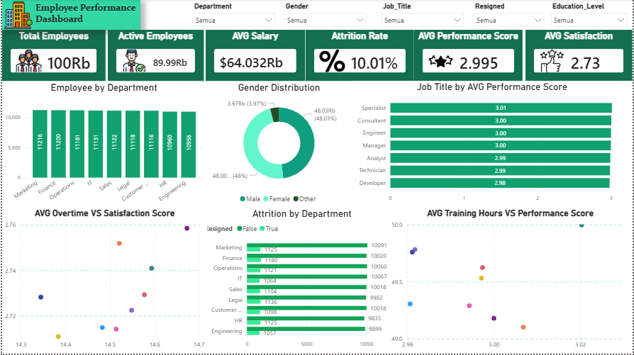

# 📊 Employee Performance Dashboard

## 📌 Project Overview

This project presents an interactive **Employee Performance Dashboard** developed using **Power BI** and **SQL** to analyze employee performance, workforce distribution, attrition, and employee satisfaction. The dashboard provides HR managers and business stakeholders with valuable insights to support data-driven decision-making and workforce management.

---

## 🎯 Project Objectives

- Analyze employee distribution across departments.
- Monitor employee attrition and active workforce.
- Evaluate employee performance and satisfaction.
- Compare performance across different job titles.
- Explore the relationship between training hours, overtime, performance, and employee satisfaction.
- Provide actionable business recommendations based on data insights.

---

## 🛠 Tools & Technologies

- **Power BI**
- **SQL**
- **Microsoft Excel / CSV**
- **DAX**
- **Power Query**

---

## 📂 Dataset

The dataset contains **100,000 employee records**, including information such as:

- Employee_ID
- Department
- Gender
- Age
- Job_Title
- Hire_Date
- Years_At_Company
- Education_Level
- Performance_Score
- Monthly_Salary
- Work_Hours_Per_Week
- Projects_Handled
- Overtime_Hours
- Sick_Days
- Remote_Work_Frequency
- Team_Size
- Training_Hours
- Promotions
- Employee_Satisfaction_Score
- Resigned

---

## 📊 Dashboard Features

### Key Performance Indicators (KPIs)

- Total Employees
- Active Employees
- Average Salary
- Attrition Rate
- Average Performance Score
- Average Employee Satisfaction Score

### Visualizations

- Employee Distribution by Department
- Gender Distribution
- Average Performance Score by Job Title
- Average Overtime Hours vs Employee Satisfaction
- Average Training Hours vs Performance Score
- Attrition by Department

---

## 📈 Key Insights

- The company's attrition rate remains relatively low; however, continuous monitoring of the factors influencing employee resignation is recommended.
- Employee distribution across departments is relatively balanced, indicating an even allocation of the workforce.
- The average performance score is approximately **3.0**, suggesting that overall employee performance is at a moderate level.
- The average employee satisfaction score is lower than the average performance score, indicating opportunities to improve employee engagement and workplace satisfaction.
- Average training hours and performance scores are relatively consistent across all departments, suggesting that training programs are implemented uniformly but have not yet resulted in significant performance differences.
- Performance differences among job titles are minimal, indicating a consistent employee performance evaluation standard throughout the organization.

---

## 💡 Business Recommendations

- Improve employee satisfaction through engagement initiatives, career development programs, and workplace well-being strategies.
- Evaluate the effectiveness of existing training programs to ensure they contribute to measurable improvements in employee performance.
- Conduct a more comprehensive attrition analysis by incorporating additional factors such as years of service, salary, age, and other employee characteristics to identify the primary drivers of employee turnover.

---

## 📷 Dashboard Preview
```
```

---

## 🚀 Project Outcomes

This dashboard enables HR professionals and decision-makers to:

- Monitor workforce performance through interactive visualizations.
- Identify trends related to employee satisfaction and attrition.
- Support strategic HR planning with data-driven insights.
- Improve workforce management through actionable business recommendations.

---

## 👩‍💻 Author

**Rafika Humairah**

Aspiring Data Analyst passionate about transforming data into actionable business insights through data visualization and analytics.

- GitHub: *Your GitHub Profile*
- LinkedIn: *Your LinkedIn Profile*
